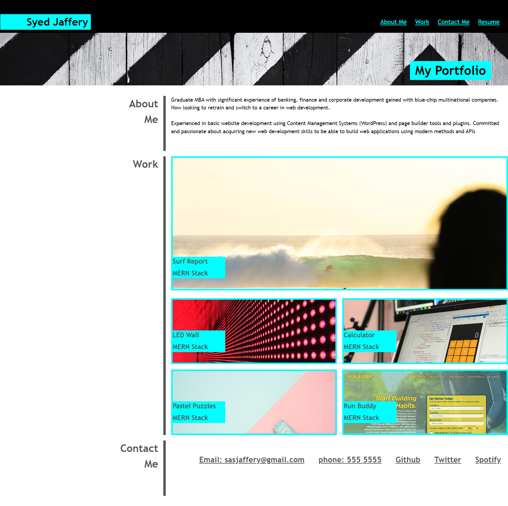

# Portfolio page using CSS Grid

Visit website (https://syed-jaffery.github.io/2-CSS-Grid-Portfolio/)

IMPORTANT - Please see above website screen capture as GitHub pages is not rendering the website correctly

## Description

A portfolio site is essential to showcase a collection of past projects when applying for a job or seeking freelance work. 

The types of projects in the portfolio should demonstrate different aspects of web development with the use of specific frameworks and technologies.

###  Oveview

This portfolio website specifically requires the use of the CSS Grid in order to demonstrate competence in its use.

The website is effectively a template that can be added to as new projects are completed. 

### Future Enhancements

Add more projects to the Portfolio page

# Installation

N/A

# Usage

N/A

# Credits

N/A

# License

MIT